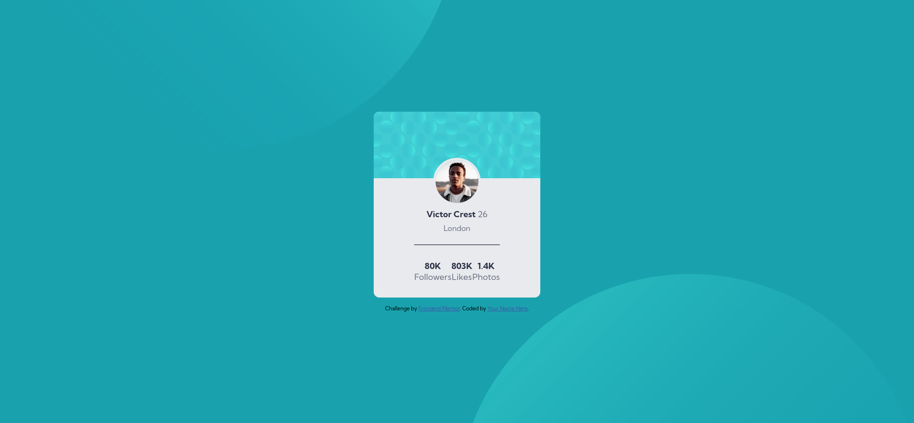

# Frontend Mentor - Profile card component main solution

This is a solution to the [Stats preview card component challenge on Frontend Mentor]()

## Table of contents

- [Overview](#overview)
  - [Screenshot](#screenshot)
  - [Links](#links)
- [My process](#my-process)
  - [Built with](#built-with)
- [Author](#author)

## Overview

### Screenshot

### Links

- Solution URL: [https://github.com/BoCode-BM/profile-card-component-main/]
- Live Site URL: [https://modev228.github.io/profile-card-component-main/]

## My process

### Built with

- Semantic HTML5 markup
- SASS/SCSS
- Flexbox
- Mobile-first workflow

## Author

- Site Live - [site](https://bocode-bm.github.io/stats-preview-card-component-main/)
- Frontend Mentor - [@BoCode-BM](https://www.frontendmentor.io/profile/BoCode-BM)
